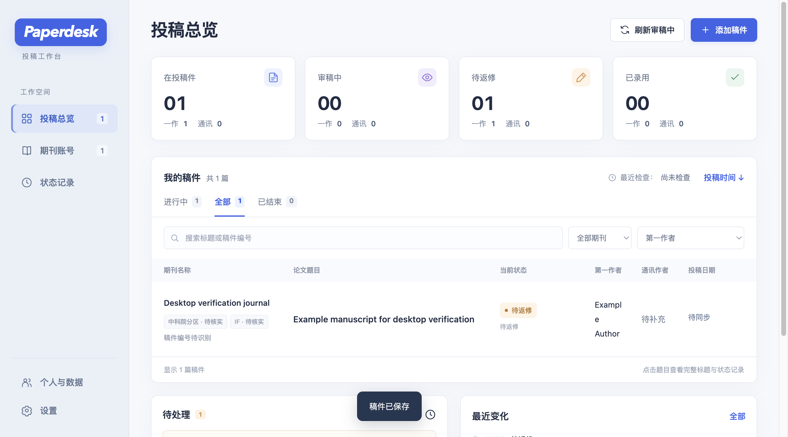

# Paperdesk

**论文投稿状态桌面工作台**

[下载软件](https://github.com/jiahangli-Buaa/paperdesk/releases/latest) · [使用指南](docs/使用指南.md) · [支持的平台](docs/平台适配范围.md) · [问题反馈](https://github.com/jiahangli-Buaa/paperdesk/issues)

Paperdesk 把多个期刊账号下的稿件、审稿进度、返修期限和状态历史汇总到一个桌面窗口。稿件与设置保存在自己的电脑，账号密码由系统凭据存储保护。



## 功能

- **投稿总览**：按期刊、状态和作者身份筛选，查看第一作者与通讯作者稿件。
- **期刊账号**：自行添加期刊与投稿网址，集中管理多个账号。
- **状态记录**：读取支持平台的稿件状态，保留原始状态、投稿日期和变化历史。
- **返修提醒**：记录返修截止日期，通过桌面通知及时查看。
- **桌面体验**：托盘／菜单栏入口、后台驻留、定时刷新与可选开机启动。
- **个人设置**：姓名、其他署名、时区、主题与背景。
- **数据管理**：导出和恢复稿件备份，支持旧版 Mac 数据导入。

支持 ScholarOne、Editorial Manager、PaperCept，提供 Open Journal Systems 3.4 试用读取。具体入口与登录方式见 [支持的平台](docs/平台适配范围.md)。

## 下载软件

当前版本：**1.0**。

| 平台 | 下载 | 系统要求 |
| --- | --- | --- |
| Apple Silicon Mac | [Paperdesk-1.0-Mac.dmg](https://github.com/jiahangli-Buaa/paperdesk/releases/download/v1.0/Paperdesk-1.0-Mac.dmg) | macOS 14 及以上 |
| Windows Intel／AMD 64 位 | [Paperdesk-1.0-Windows.exe](https://github.com/jiahangli-Buaa/paperdesk/releases/download/v1.0/Paperdesk-1.0-Windows.exe) | Windows 11 x64 |

Windows 安装过程中自动下载投稿读取组件；Mac 首次打开时自动下载。请保持网络连接，完成后的日常启动会复用已下载组件，无需另外安装 Python 或 Node.js。

首次使用填写自己的姓名，再添加期刊与账号。新安装从空白期刊列表开始。

## 本地数据

账号密码存入 macOS 钥匙串，或由 Windows DPAPI 加密保存。稿件数据库、浏览器会话与个人设置位于本机应用数据目录。备份包含稿件和设置，恢复或换电脑后重新登录账号即可。

## 从源码运行

准备 Node.js 24 和 Python 3.13，在项目目录执行：

```sh
npm ci
python3 scripts/prepare_runtime.py macos-arm64
npm start
```

Windows 使用 `python scripts/prepare_runtime.py windows-x64` 准备运行组件。构建方式见 [开发与构建](docs/开发与构建.md)。

## 项目结构

| 目录 | 内容 |
| --- | --- |
| `src/desktop/` | 桌面窗口、组件下载、托盘与更新入口 |
| `src/backend/` | 稿件、刷新任务、凭据和备份恢复 |
| `src/readers/` | 投稿平台读取组件 |
| `src/ui/` | 界面和样式 |
| `assets/` | 图标 |
| `build/config/` | 打包配置 |
| `scripts/`、`tests/` | 开发工具与测试 |

## 贡献与许可证

欢迎提交 Issue 和 Pull Request，见 [贡献指南](CONTRIBUTING.md)。安全问题请参阅 [SECURITY.md](SECURITY.md)。

源码使用 [MIT 许可证](LICENSE)。第三方组件保留各自许可，见 [第三方组件说明](docs/第三方组件说明.md)。
